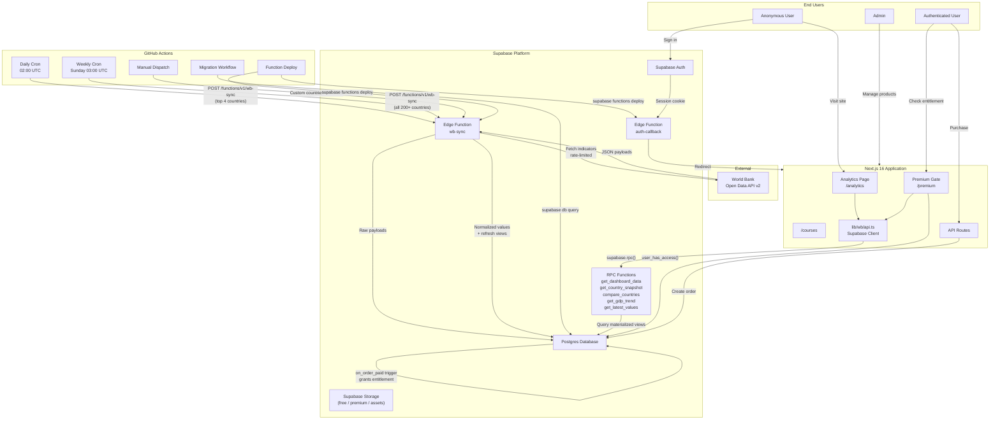
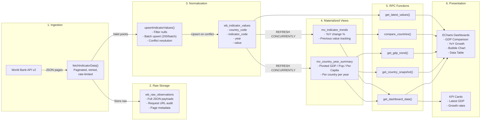
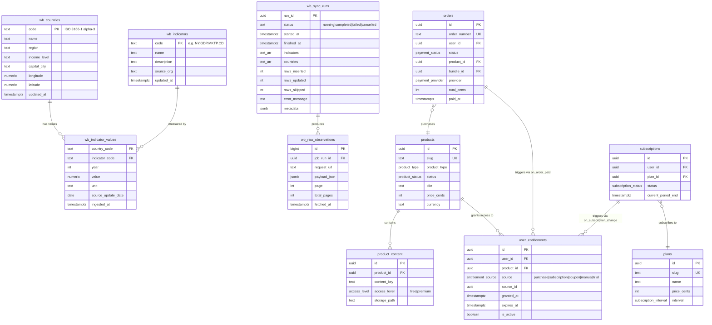
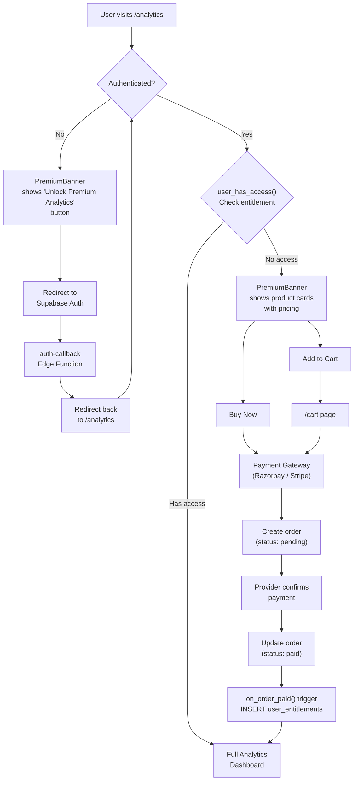
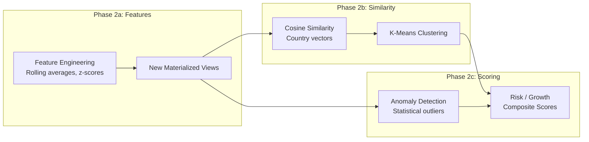

# The Puffer Labs -- Global Economic Intelligence Platform

## Architecture Document

**Version:** 1.0
**Last Updated:** 2026-04-16
**Platform:** thepufferlabs.com

---

## Table of Contents

1. [System Overview](#1-system-overview)
2. [Architecture Diagram](#2-architecture-diagram)
3. [Data Pipeline Architecture](#3-data-pipeline-architecture)
4. [Crawl Strategy](#4-crawl-strategy)
5. [Database Schema Overview](#5-database-schema-overview)
6. [Indicator Strategy](#6-indicator-strategy)
7. [Scheduling Strategy](#7-scheduling-strategy)
8. [Premium Access Model](#8-premium-access-model)
9. [Future ML Pipeline (Phase 2)](#9-future-ml-pipeline-phase-2)
10. [Development Workflow](#10-development-workflow)

---

## 1. System Overview

### Purpose

The Global Economic Intelligence Platform is a data analytics system that mines World Bank economic data for 200+ countries across 20+ macroeconomic indicators. It ingests, normalizes, and visualizes economic trends (GDP, population, per-capita income, growth rates) through interactive dashboards backed by materialized views and Supabase RPC functions.

### Tech Stack

| Layer | Technology | Role |
|-------|-----------|------|
| **Frontend** | Next.js 16 (React 19) | App router, server/client components, static + dynamic rendering |
| **Charting** | ECharts 5.6 (via echarts-for-react) | GDP comparisons, YoY growth, bubble charts, data tables |
| **UI Framework** | Tailwind CSS 4, Radix UI, Framer Motion | Styling, accessible primitives, animations |
| **Backend/BaaS** | Supabase (Postgres + Edge Functions + Auth + Storage) | Database, API layer, authentication, file storage |
| **Data Source** | World Bank Open Data API (v2) | Primary source for all economic indicators |
| **Orchestration** | GitHub Actions | Scheduled crawls, CI/CD, migrations, Edge Function deployment |
| **Auth** | Supabase Auth | Email/OAuth, session management, RLS integration |
| **Payments** | Razorpay (India) / Stripe (international) | Order processing, entitlement grants |

### Data Source

All economic data is sourced from the **World Bank Open Data API v2** (`https://api.worldbank.org/v2`). The API provides free access to thousands of development indicators for every country, with historical data spanning decades. The platform currently focuses on a curated set of 20+ indicators across economic output, demographics, trade, and financial metrics.

---

## 2. Architecture Diagram



---

## 3. Data Pipeline Architecture



### Pipeline Steps in Detail

| Step | Component | Description |
|------|-----------|-------------|
| **1. Trigger** | GitHub Actions cron | Fires at scheduled intervals; calls the `wb-sync` Edge Function with a JSON body containing country and indicator arrays |
| **2. Overlap Guard** | `checkOverlappingRun()` | Queries `wb_sync_runs` for status = 'running'. Blocks if a run is active (< 30 min). Auto-cancels stale locks. |
| **3. API Fetch** | `fetchIndicatorData()` | Paginates through World Bank API (`per_page=500`). Implements exponential backoff retry (3 attempts). Stores every raw response page. |
| **4. Transform** | `upsertIndicatorValues()` | Filters null values, maps to normalized schema, batch-upserts in groups of 200 rows with `ON CONFLICT` resolution. |
| **5. Materialize** | `refresh_wb_materialized_views()` | Refreshes `mv_country_year_summary` and `mv_indicator_trends` concurrently after each sync run completes. |
| **6. Serve** | Supabase RPC | Five SQL functions exposed as RPC endpoints. The Next.js client calls `supabase.rpc()` to fetch pre-computed analytics data. |

---

## 4. Crawl Strategy

### Phased Batched Crawling

The platform is designed to scale to 200+ countries. To respect the World Bank API rate limits and avoid timeouts in Edge Functions, the crawl operates in phases:

| Phase | Countries | Frequency | Description |
|-------|-----------|-----------|-------------|
| **Daily Incremental** | Top 4 (IND, USA, CHN, GBR) | Every day at 02:00 UTC | Keeps the most-viewed countries fresh |
| **Weekly Full Crawl** | All 200+ countries | Sunday at 03:00 UTC | Comprehensive refresh of all country data |
| **Manual Dispatch** | Custom | On-demand | Accepts comma-separated country and indicator lists via GitHub Actions UI |

### Rate Limiting

| Mechanism | Value | Implementation |
|-----------|-------|----------------|
| Delay between API calls | 1,000 ms | `RATE_LIMIT_DELAY_MS` constant; `sleep()` between paginated requests |
| Delay between batches | 5,000 ms | Applied between country batches in full crawl mode |
| API response 429 handling | Exponential backoff | `fetchWithRetry()`: starts at 1s, doubles per attempt, max 3 retries |
| Batch size for upsert | 200 rows | Keeps database write operations bounded |

### Overlap Protection

The `wb_sync_runs` table acts as a distributed lock:

1. Before starting, the Edge Function queries for any run with `status = 'running'`.
2. If a run has been active for less than 30 minutes, the new invocation returns HTTP 409 (Conflict).
3. If a run has been active for more than 30 minutes, it is marked as `cancelled` (stale lock), and the new run proceeds.
4. Each run records `rows_inserted`, `rows_updated`, `rows_skipped`, and `error_message` on completion.

### Resume Capability

The `wb-sync` Edge Function accepts custom `countries` and `indicators` arrays in the POST body. This enables:

- Retrying failed batches by specifying only the countries that failed.
- Manual dispatch via GitHub Actions `workflow_dispatch` with custom inputs.
- Incremental expansion by adding new country codes to the crawl list.

---

## 5. Database Schema Overview



### Materialized Views

| View | Source | Purpose | Refresh |
|------|--------|---------|---------|
| `mv_country_year_summary` | `wb_indicator_values` JOIN `wb_countries` | Pivoted GDP, population, GDP per capita per country per year | After each sync run |
| `mv_indicator_trends` | `wb_indicator_values` JOIN `wb_countries` JOIN `wb_indicators` | Year-over-year change calculation using `LAG()` window function | After each sync run |

### Key Indexes

| Index | Table | Columns | Purpose |
|-------|-------|---------|---------|
| `idx_wb_values_indicator_country_year` | `wb_indicator_values` | `indicator_code, country_code, year` | Fast indicator lookup per country |
| `idx_wb_values_country_year` | `wb_indicator_values` | `country_code, year` | Country-centric queries |
| `idx_wb_values_year` | `wb_indicator_values` | `year DESC` | Cross-country comparisons for a given year |
| `idx_wb_raw_job_run` | `wb_raw_observations` | `job_run_id` | Audit trail lookup |
| `idx_wb_sync_status` | `wb_sync_runs` | `status, started_at DESC` | Overlap guard queries |

---

## 6. Indicator Strategy

The platform currently tracks 3 core indicators with plans to expand to 20+ in the full crawl phase.

### Current Indicators (Phase 1)

| Code | Name | Category | Frequency | Dashboard Use |
|------|------|----------|-----------|---------------|
| `NY.GDP.MKTP.CD` | GDP (current US$) | Economic Output | Annual | KPI cards, comparison charts, trend lines |
| `NY.GDP.PCAP.CD` | GDP per capita (current US$) | Economic Output | Annual | Per-capita comparison, bubble chart |
| `SP.POP.TOTL` | Population, total | Demographics | Annual | Population trends, bubble size |

### Planned Indicators (Phase 2)

| Code | Name | Category | Use in Features | Similarity | Risk Score |
|------|------|----------|-----------------|------------|------------|
| `NY.GDP.MKTP.KD.ZG` | GDP growth (annual %) | Economic Output | Growth trend charts | Yes | Yes |
| `FP.CPI.TOTL.ZG` | Inflation, consumer prices (annual %) | Prices | Inflation dashboard | Yes | Yes |
| `SL.UEM.TOTL.ZS` | Unemployment, total (% of labor force) | Labor | Employment analysis | Yes | Yes |
| `NE.TRD.GNFS.ZS` | Trade (% of GDP) | Trade | Trade openness | Yes | No |
| `BN.CAB.XOKA.CD` | Current account balance (BoP, current US$) | Trade | Balance of payments | Yes | Yes |
| `GC.DOD.TOTL.GD.ZS` | Central government debt (% of GDP) | Fiscal | Debt analysis | No | Yes |
| `NE.EXP.GNFS.ZS` | Exports of goods and services (% of GDP) | Trade | Export dependency | Yes | No |
| `NE.IMP.GNFS.ZS` | Imports of goods and services (% of GDP) | Trade | Import dependency | Yes | No |
| `BX.KLT.DINV.WD.GD.ZS` | FDI, net inflows (% of GDP) | Investment | Investment flows | Yes | No |
| `FR.INR.LEND` | Lending interest rate (%) | Financial | Monetary policy | No | Yes |
| `PA.NUS.FCRF` | Official exchange rate (LCU per US$) | Financial | Currency analysis | No | Yes |
| `SP.DYN.LE00.IN` | Life expectancy at birth (years) | Demographics | Human development | Yes | No |
| `SE.ADT.LITR.ZS` | Literacy rate, adult total (%) | Education | Development profile | Yes | No |
| `EG.USE.PCAP.KG.OE` | Energy use (kg of oil equivalent per capita) | Energy | Resource analysis | Yes | No |
| `EN.ATM.CO2E.PC` | CO2 emissions (metric tons per capita) | Environment | Sustainability | Yes | Yes |
| `IT.NET.USER.ZS` | Individuals using the Internet (%) | Technology | Digital readiness | Yes | No |
| `SP.URB.TOTL.IN.ZS` | Urban population (% of total) | Demographics | Urbanization | Yes | No |

### Indicator Design Principles

- **Annual frequency only**: The World Bank API primarily publishes annual data. Monthly/quarterly indicators are out of scope for Phase 1.
- **Normalized units**: All monetary values are stored in current US dollars. Percentage-based indicators are stored as-is.
- **Null handling**: Data points with `value = null` are filtered during ingestion but the raw payload is preserved for audit.

---

## 7. Scheduling Strategy

All scheduled jobs are managed through GitHub Actions cron triggers and Supabase mechanisms.

| Job | Schedule | Trigger | Purpose | Configuration |
|-----|----------|---------|---------|---------------|
| **Daily Sync (top countries)** | `0 2 * * *` (02:00 UTC daily) | GitHub Actions cron | Refresh IND, USA, CHN, GBR for core indicators | `wb-sync-cron.yml` |
| **Full Crawl (all countries)** | `0 3 * * 0` (03:00 UTC Sunday) | GitHub Actions cron (planned) | Comprehensive 200+ country refresh in batches of 15 | `wb-sync-cron.yml` with expanded input |
| **Edge Function Deploy** | On push to `supabase/functions/**` on `main` | GitHub Actions push trigger | Deploys `wb-sync` and `auth-callback` Edge Functions | `supabase-functions.yml` |
| **Database Migration** | On push to `supabase/migrations/*.sql` on `main` | GitHub Actions push trigger | Runs new SQL migrations via Supabase CLI | `supabase-migrate.yml` |
| **Materialized View Refresh** | After each sync run | Called by `wb-sync` Edge Function | `REFRESH MATERIALIZED VIEW CONCURRENTLY` for both views | `refresh_wb_materialized_views()` |
| **Data Quality Checks** | Weekly (planned) | GitHub Actions cron (planned) | Validate row counts, null ratios, freshness per indicator | To be added |

### GitHub Actions Workflows

| Workflow File | Trigger | Secrets Required |
|---------------|---------|-----------------|
| `wb-sync-cron.yml` | Scheduled + manual dispatch | `SUPABASE_URL`, `SUPABASE_SERVICE_ROLE_KEY` |
| `supabase-functions.yml` | Push to `supabase/functions/**` | `SUPABASE_PROJECT_REF`, `SUPABASE_ACCESS_TOKEN`, `SUPABASE_URL`, `SUPABASE_ANON_KEY`, `SUPABASE_SERVICE_ROLE_KEY` |
| `supabase-migrate.yml` | Push to `supabase/migrations/*.sql` | `SUPABASE_PROJECT_REF`, `SUPABASE_ACCESS_TOKEN`, `SUPABASE_DB_PASSWORD` |
| `deploy.yml` | Push to `main` | Next.js deployment secrets |
| `promote-admin.yml` | Manual dispatch | Supabase admin secrets |
| `supabase-clean.yml` | Manual dispatch | Supabase admin secrets |

---

## 8. Premium Access Model

The analytics dashboard is gated behind a premium access system. The entitlement model is product-based: users purchase (or subscribe to) a product, which grants them an entitlement row in `user_entitlements`.

### Access Control Flow



### Key Components

| Component | Location | Role |
|-----------|----------|------|
| `PremiumBanner` | `src/components/analytics/PremiumBanner.tsx` | Renders three states: unauthenticated (sign-in CTA), authenticated without access (product cards), or access granted (confirmation badge) |
| `PremiumGate` | `src/components/courses/PremiumGate.tsx` | Generic gate wrapper for course content |
| `user_has_access()` | SQL function | Returns boolean: checks `user_entitlements` for active, non-expired row |
| `user_can_read_content()` | SQL function | Returns boolean: free content always accessible, premium requires entitlement |
| `on_order_paid()` | SQL trigger on `orders` | Automatically creates entitlement row when order status changes to `paid` |
| `on_subscription_change()` | SQL trigger on `subscriptions` | Automatically creates/deactivates entitlements when subscription status changes |

### Entitlement Sources

| Source | Trigger | Expiry |
|--------|---------|--------|
| `purchase` | `on_order_paid()` trigger | 1 year from purchase |
| `subscription` | `on_subscription_change()` trigger | `current_period_end` of subscription |
| `coupon` | Manual grant | Configurable |
| `manual` | Admin action | Configurable |
| `trial` | Plan trial period | `trial_end` date |

### RLS Integration

Row-level security policies enforce access at the database level:

- `wb_indicator_values`, `wb_countries`, `wb_indicators`: Public read (no paywall on raw data queries).
- `product_content` with `access_level = 'premium'`: Requires `user_has_access()` check.
- `storage.objects` in `premium-content` bucket: Requires active entitlement matching the product slug to the storage folder.

---

## 9. Future ML Pipeline (Phase 2)

The following machine learning and advanced analytics capabilities are planned for Phase 2, building on the normalized indicator data already in Postgres.

### 9.1 Feature Engineering

| Feature | Computation | Storage |
|---------|-------------|---------|
| **Rolling Averages** | 3-year and 5-year moving averages per indicator per country | New materialized view `mv_rolling_averages` |
| **Z-Scores** | Standardized values relative to global mean/stddev per indicator per year | Computed column or materialized view |
| **Growth Rates** | CAGR (Compound Annual Growth Rate) over 5-year and 10-year windows | Extension of `get_country_snapshot()` |
| **Volatility** | Standard deviation of YoY changes over trailing 10 years | New RPC function |

### 9.2 Country Similarity

**Method:** Cosine similarity on a feature vector per country.

- Feature vector: latest values for all similarity-eligible indicators (see Indicator Strategy table, "Similarity" column).
- Normalization: Min-max scaling per indicator across all countries.
- Output: `mv_country_similarity` materialized view with `(country_a, country_b, similarity_score)`.
- UI: "Countries similar to X" panel on country report pages.

### 9.3 Clustering

**Method:** K-means clustering on the same normalized feature vectors.

- K selection: Elbow method or silhouette score, evaluated offline.
- Cluster count: Target 5-8 clusters representing economic archetypes (e.g., "high-income stable", "emerging growth", "resource-dependent").
- Output: `country_cluster` column added to `wb_countries` or stored in a new `wb_country_clusters` table.
- UI: Cluster map visualization, cluster comparison dashboards.

### 9.4 Anomaly Detection

**Method:** Statistical outlier detection on YoY changes.

- Flag data points where YoY change exceeds 2 standard deviations from that indicator's historical mean for the country.
- Store anomalies in `wb_anomalies` table with severity score.
- UI: Anomaly alerts on dashboard, highlighted data points on charts.

### 9.5 Risk and Growth Scoring

**Method:** Composite scoring model.

- **Risk Score** (0-100): Weighted sum of debt-to-GDP, inflation, unemployment, current account deficit, CO2 emissions trend.
- **Growth Score** (0-100): Weighted sum of GDP growth, FDI inflows, trade openness, urbanization rate, internet penetration.
- Weights determined by domain expertise, refined via backtesting against historical outcomes.
- Output: `mv_country_scores` materialized view, refreshed weekly.
- UI: Country scorecard with radar chart visualization.

### Implementation Plan



---

## 10. Development Workflow

### Local Development Setup

```bash
# 1. Clone the repository
git clone https://github.com/thepufferlabs/thepufferlabs-1.git
cd thepufferlabs-1

# 2. Install dependencies
npm install

# 3. Set up environment variables
cp .env.example .env.local
# Edit .env.local with your Supabase project credentials:
#   NEXT_PUBLIC_SUPABASE_URL=https://your-project.supabase.co
#   NEXT_PUBLIC_SUPABASE_ANON_KEY=your-anon-key

# 4. Start the development server
npm run dev

# 5. (Optional) Start Supabase locally
supabase start
supabase db reset  # Apply all migrations
```

### Migration Workflow

1. Create a new SQL file in `supabase/migrations/` following the naming convention:
   ```
   YYYYMMDD_NNN_description.sql
   ```
   Example: `20260420_001_add_new_indicator.sql`

2. Include a `schema_migrations` insert at the end of the file:
   ```sql
   INSERT INTO schema_migrations (version, name)
   VALUES ('20260420_001', 'add_new_indicator')
   ON CONFLICT (version) DO NOTHING;
   ```

3. Push to `main`. The `supabase-migrate.yml` workflow automatically:
   - Checks `schema_migrations` for already-applied versions.
   - Skips cleanup scripts (files matching `*_000_cleanup*`).
   - Applies new migrations in filename order.
   - Prints a summary table in the GitHub Actions run.

### Edge Function Development

```bash
# Local development with Deno
cd supabase/functions/wb-sync
deno run --allow-net --allow-env index.ts

# Deploy manually (usually handled by CI)
supabase functions deploy wb-sync --no-verify-jwt
supabase functions deploy auth-callback --no-verify-jwt

# Set secrets
supabase secrets set SITE_URL=https://thepufferlabs.com
```

### GitHub Actions Secrets Required

| Secret | Used By | Description |
|--------|---------|-------------|
| `SUPABASE_URL` | `wb-sync-cron.yml`, `supabase-functions.yml` | Supabase project URL (`https://xxx.supabase.co`) |
| `SUPABASE_ANON_KEY` | `supabase-functions.yml` | Supabase anonymous/public key |
| `SUPABASE_SERVICE_ROLE_KEY` | `wb-sync-cron.yml`, `supabase-functions.yml` | Supabase service role key (full database access) |
| `SUPABASE_PROJECT_REF` | `supabase-functions.yml`, `supabase-migrate.yml` | Supabase project reference ID |
| `SUPABASE_ACCESS_TOKEN` | `supabase-functions.yml`, `supabase-migrate.yml` | Supabase personal access token for CLI authentication |
| `SUPABASE_DB_PASSWORD` | `supabase-migrate.yml` | Database password for direct SQL execution |

### Code Quality

| Tool | Command | Purpose |
|------|---------|---------|
| ESLint | `npm run lint` | TypeScript/React linting |
| Prettier | `npm run format` | Code formatting |
| Husky + lint-staged | Pre-commit hook | Auto-fix on commit |
| Combined | `npm run fix` | ESLint fix + Prettier in one pass |

### Project Structure

```
thepufferlabs-1/
  .github/
    workflows/
      deploy.yml                  # Next.js deployment
      promote-admin.yml           # Admin role management
      supabase-clean.yml          # Database cleanup (manual)
      supabase-functions.yml      # Edge Function deployment
      supabase-migrate.yml        # Database migration runner
      wb-sync-cron.yml            # Scheduled World Bank data sync
  src/
    app/
      analytics/page.tsx          # Main analytics dashboard
      premium/                    # Premium access pages
      courses/                    # Course content
      admin/                      # Admin panel
      billing/                    # Billing/payment pages
      account/                    # User account
      api/                        # API routes
    components/
      analytics/
        PremiumBanner.tsx         # Premium access gate UI
        GDPComparisonChart.tsx    # ECharts GDP comparison
        YoYGrowthChart.tsx        # Year-over-year growth
        WorldMapChart.tsx         # Bubble chart visualization
        KPICard.tsx               # Key performance indicator cards
        CountrySelector.tsx       # Country filter toggle
        DataTable.tsx             # Tabular data display
        CountryReportCard.tsx     # Country snapshot card
      courses/
        PremiumGate.tsx           # Course content gate
        PremiumContentBadge.tsx   # Premium content indicator
    lib/
      wb/
        api.ts                    # Supabase RPC client functions
        types.ts                  # TypeScript types for WB data
      supabase.ts                 # Supabase client initialization
      supabase-server.ts          # Server-side Supabase client
  supabase/
    functions/
      wb-sync/index.ts            # World Bank data sync Edge Function
      auth-callback/              # Auth callback Edge Function
    migrations/
      20260405_001_foundation.sql # Core schema (users, audit, etc.)
      20260405_002_product_catalog.sql
      20260405_003_licensing.sql  # Entitlements, subscriptions
      20260405_004_payments.sql   # Orders, refunds, coupons
      20260405_005_online_courses.sql
      20260405_006_admin_rls.sql
      20260410_001_wb_schema.sql  # World Bank tables + views
      20260410_003_wb_analytics_queries.sql  # RPC functions
  scripts/
    sync-docs.mjs                 # Documentation sync utility
  docs/
    architecture.md               # This document
```

---

*This document describes the architecture as of 2026-04-16. It will be updated as the platform evolves through Phase 2 and beyond.*
