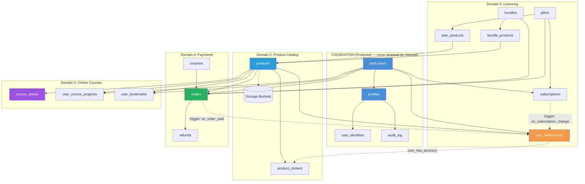
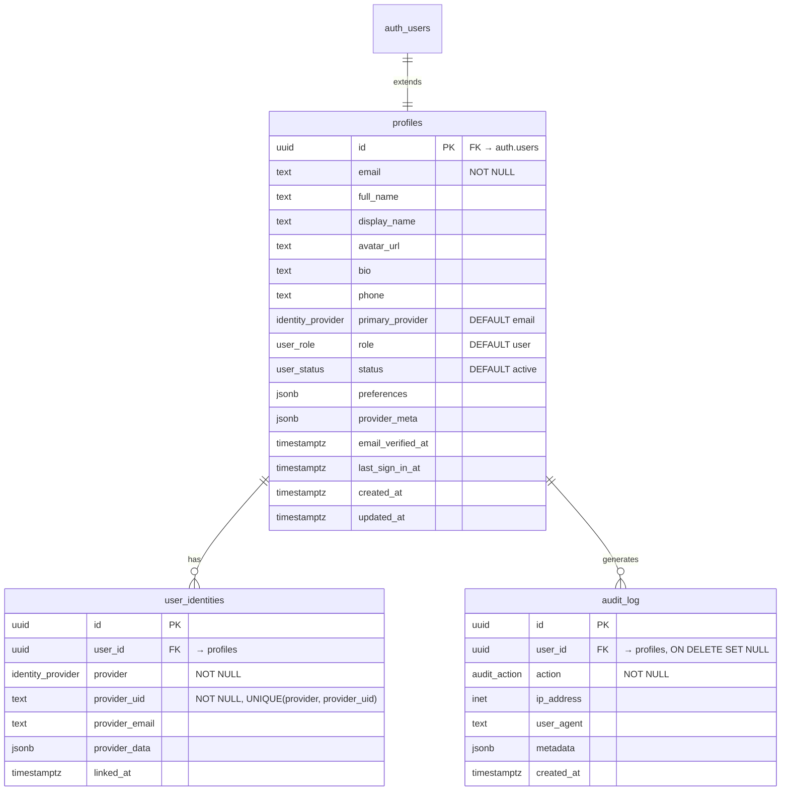
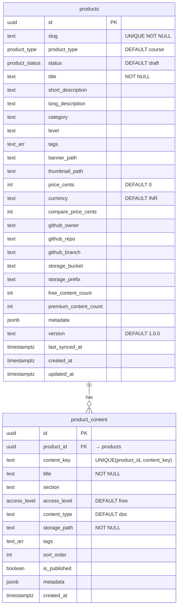
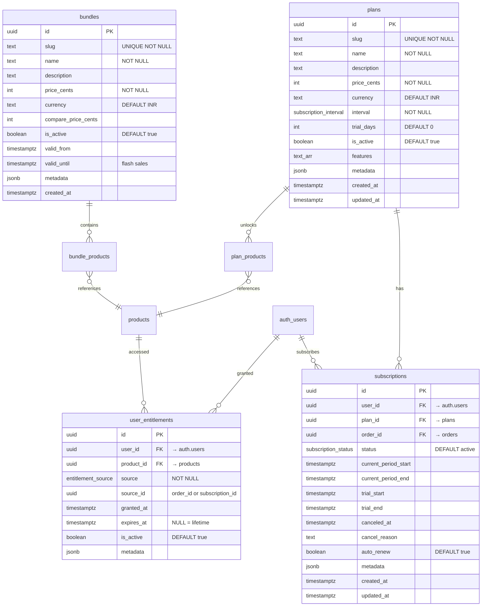
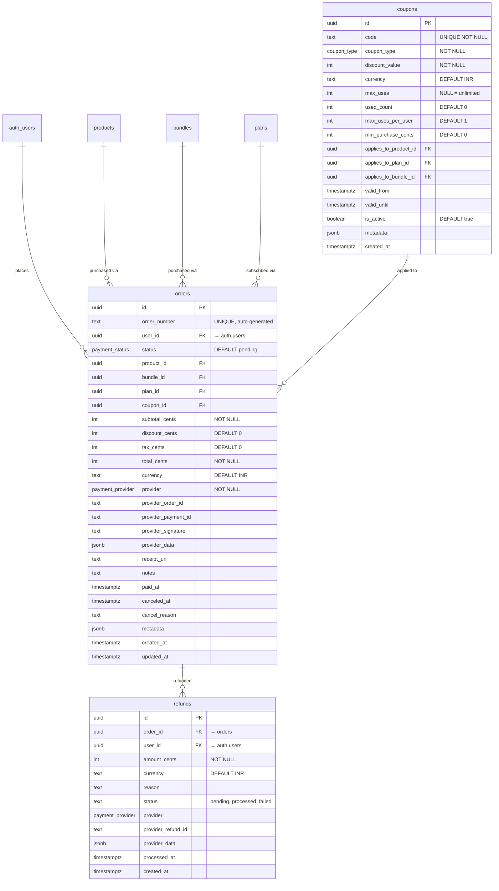
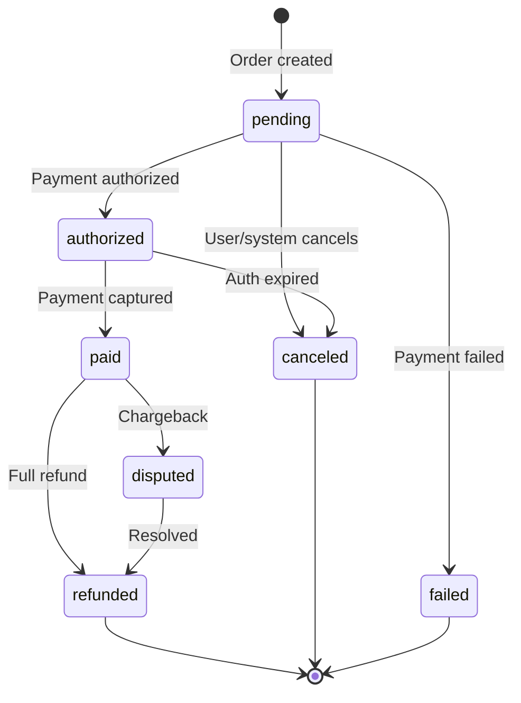
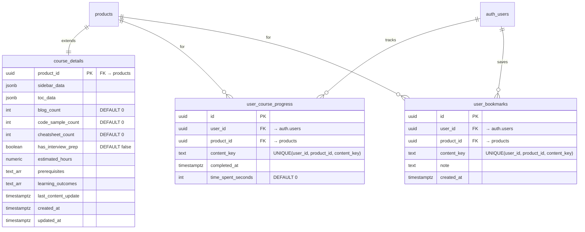
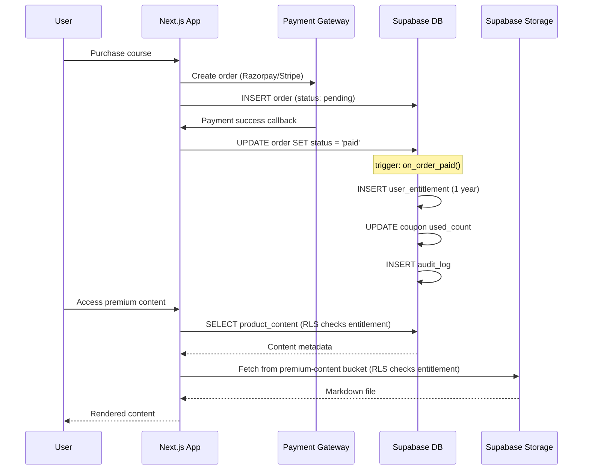
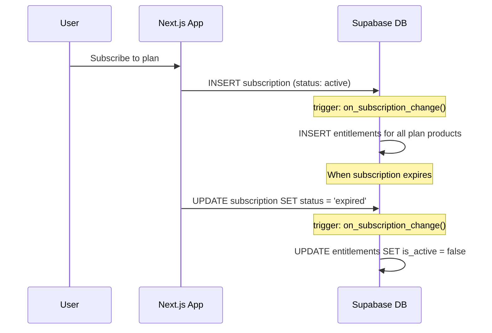
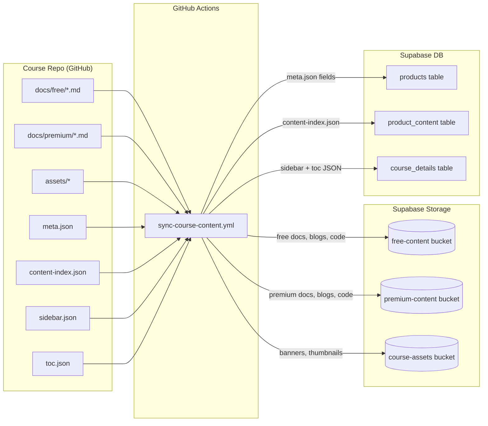

# The Puffer Labs — Database Schema

## Architecture Overview

The schema uses a **two-tier architecture**:

- **Foundation layer** (Domain 1) — profiles, auth triggers, audit log. **PROTECTED** — never dropped by cleanup. Without this, OAuth signup breaks.
- **Feature layers** (Domains 2-5) — products, licensing, payments, courses. Can be safely dropped and recreated without affecting auth.



---

## Domain 1: Foundation (PROTECTED)

Migration: `20260405_001_foundation.sql`

The bedrock of the platform. Extends Supabase `auth.users` with profiles, federated identity links, and an immutable audit trail. Includes auth triggers that auto-create profiles on signup and track logins.

**This layer is never dropped by the standard cleanup.** Dropping it breaks OAuth signup with "Database error granting user". Only the nuclear cleanup (`000_cleanup_nuclear.sql`) touches this layer.



### Enums

| Type | Values |
|------|--------|
| `user_role` | `user`, `premium`, `admin`, `super_admin` |
| `user_status` | `active`, `inactive`, `suspended`, `banned` |
| `identity_provider` | `email`, `github`, `google` |
| `audit_action` | `login`, `logout`, `register`, `password_reset`, `profile_update`, `role_change`, `subscription_change`, `premium_access`, `account_suspended`, `account_reactivated`, `purchase`, `refund` |

### RLS Policies

| Table | Policy | Rule |
|-------|--------|------|
| profiles | Users read own profile | `auth.uid() = id` |
| profiles | Users update own profile | `auth.uid() = id` |
| user_identities | Users read own identities | `auth.uid() = user_id` |
| audit_log | Users read own audit log | `auth.uid() = user_id` |

---

## Domain 2: Product Catalog

Migration: `20260405_002_product_catalog.sql`

Generic product system that supports courses, data services, tools, and bundles. Content files are stored in Supabase Storage, metadata in the database.



### Enums

| Type | Values |
|------|--------|
| `product_type` | `course`, `data_service`, `tool`, `bundle` |
| `product_status` | `draft`, `published`, `archived` |
| `access_level` | `free`, `premium` |

### Storage Buckets

| Bucket | Public | Purpose |
|--------|--------|---------|
| `free-content` | Yes | Free docs, blogs, code samples, metadata JSONs |
| `premium-content` | No | Premium docs, blogs, code — RLS-gated by entitlements |
| `course-assets` | Yes | Banners, thumbnails, preview images |

### RLS Policies

| Table/Bucket | Policy | Rule |
|--------------|--------|------|
| products | Published products are public | `status = 'published'` |
| free-content | Free content is public | Public read |
| course-assets | Course assets are public | Public read |
| All buckets | Service role writes/updates/deletes | `auth.role() = 'service_role'` |

---

## Domain 3: Licensing, Subscriptions & Entitlements

Migration: `20260405_003_licensing.sql`

The access control layer. `user_entitlements` is the **single source of truth** for "can user X access product Y?"



### Enums

| Type | Values |
|------|--------|
| `subscription_status` | `trialing`, `active`, `past_due`, `canceled`, `expired` |
| `subscription_interval` | `month`, `quarter`, `year`, `lifetime` |
| `entitlement_source` | `purchase`, `subscription`, `coupon`, `manual`, `trial` |

### Access Control Functions

```sql
-- Check if user has active entitlement for a product
user_has_access(user_id uuid, product_id uuid) → boolean

-- Check if content is free OR user has access to its product
user_can_read_content(user_id uuid, content_id uuid) → boolean
```

### Triggers

| Trigger | Event | Action |
|---------|-------|--------|
| `trg_subscription_change` | subscription status changes | Grants entitlements for all plan products when `active`, revokes when `canceled`/`expired` |

### RLS Policies

| Table | Policy | Rule |
|-------|--------|------|
| plans | Plans are public | `is_active = true` |
| bundles | Active bundles are public | `is_active = true` |
| plan_products | Plan products are public | Always visible |
| bundle_products | Bundle products are public | Always visible |
| subscriptions | Users see own subs | `auth.uid() = user_id` |
| user_entitlements | Users see own entitlements | `auth.uid() = user_id` |
| product_content | Free public, premium gated | `access_level = 'free' OR user_has_access()` |
| premium-content bucket | Premium storage gated | Matches product slug from folder path against user entitlements |

---

## Domain 4: Payment Gateway & Order Management

Migration: `20260405_004_payments.sql`

Provider-agnostic payment system supporting Razorpay (India) and Stripe (international). Full order lifecycle with refund tracking.



### Order Lifecycle



### Enums

| Type | Values |
|------|--------|
| `payment_provider` | `razorpay`, `stripe`, `manual`, `coupon` |
| `payment_status` | `pending`, `authorized`, `paid`, `failed`, `refunded`, `disputed`, `canceled` |
| `coupon_type` | `percent`, `fixed_amount` |

### Triggers

| Trigger | Event | Action |
|---------|-------|--------|
| `trg_order_status` | order status changes to `paid` | Grants 1-year entitlements for product/bundle, updates coupon usage, logs to audit |
| `trg_order_status` | order status changes to `refunded` | Revokes entitlements, logs to audit |
| `trg_order_status` | order status changes to `canceled` | Sets `canceled_at` timestamp |

### RLS Policies

| Table | Policy | Rule |
|-------|--------|------|
| coupons | Valid coupons are public | `is_active AND valid AND under max_uses` |
| orders | Users see own orders | `auth.uid() = user_id` |
| orders | Users create orders | `auth.uid() = user_id` |
| refunds | Users see own refunds | `auth.uid() = user_id` |

---

## Domain 5: Online Courses

Migration: `20260405_005_online_courses.sql`

Course-specific extensions on top of the generic product catalog. Stores sidebar/TOC as JSONB and tracks user learning progress.



### RLS Policies

| Table | Policy | Rule |
|-------|--------|------|
| course_details | Course details are public | Always visible (catalog info) |
| user_course_progress | Users see/track/update own progress | `auth.uid() = user_id` |
| user_bookmarks | Users manage own bookmarks | `auth.uid() = user_id` |

---

## Entitlement Flow

The system auto-manages access through database triggers. No application code needed for granting/revoking access.



### Subscription Flow



---

## Content Sync Pipeline

GitHub Actions sync content from course repos to Supabase on every push.



---

## Migration Files

| File | Layer | What it creates |
|------|-------|-----------------|
| `20260405_000_cleanup.sql` | Feature | Drops domains 2-5 only. **Auth stays intact.** |
| `20260405_000_cleanup_nuclear.sql` | ALL | Drops everything including foundation. Auth breaks. |
| `20260405_001_foundation.sql` | Foundation | `profiles`, `user_identities`, `audit_log`, auth triggers, `update_updated_at()` |
| `20260405_002_product_catalog.sql` | Feature | `products`, `product_content` + storage buckets |
| `20260405_003_licensing.sql` | Feature | `plans`, `plan_products`, `bundles`, `bundle_products`, `subscriptions`, `user_entitlements` |
| `20260405_004_payments.sql` | Feature | `coupons`, `orders`, `refunds` |
| `20260405_005_online_courses.sql` | Feature | `course_details`, `user_course_progress`, `user_bookmarks` |

### Running Migrations

```bash
# Fresh setup (run in order)
supabase db query --linked --file supabase/migrations/20260405_001_foundation.sql
supabase db query --linked --file supabase/migrations/20260405_002_product_catalog.sql
supabase db query --linked --file supabase/migrations/20260405_003_licensing.sql
supabase db query --linked --file supabase/migrations/20260405_004_payments.sql
supabase db query --linked --file supabase/migrations/20260405_005_online_courses.sql
```

### Cleanup Modes

| Mode | Scope | Auth works after? | Confirmation |
|------|-------|-------------------|-------------|
| `features-only` | Drops domains 2-5 tables | Yes | Type `DELETE` |
| `features-and-data` | Drops domains 2-5 + truncates user data | Yes (schema intact, users cleared) | Type `DELETE` |
| `nuclear` | Drops ALL tables, functions, enums, triggers | No — must re-run 001-005 | Type `NUCLEAR DELETE` |

```bash
# Reset products only (safe — auth keeps working)
supabase db query --linked --file supabase/migrations/20260405_000_cleanup.sql
# Then re-run 002-005

# Full nuclear reset (breaks auth until 001 is re-run)
supabase db query --linked --file supabase/migrations/20260405_000_cleanup_nuclear.sql
# Then re-run 001-005
```

### GitHub Workflows

| Workflow | Trigger | What it does |
|----------|---------|-------------|
| `supabase-migrate.yml` | Push to `supabase/migrations/` or manual | Runs pending migrations in order, skips cleanup files |
| `supabase-clean.yml` | Manual only | 3 cleanup modes with confirmation |
| `sync-course-content.yml` | Called by course repos | Syncs content to storage + upserts DB records |

---

## Schema Statistics

| Metric | Count |
|--------|-------|
| Tables | 16 |
| Enum types | 12 |
| Functions | 7 |
| Triggers | 9 |
| RLS policies | 33 |
| Storage buckets | 3 |
| Foreign keys | 28 |
